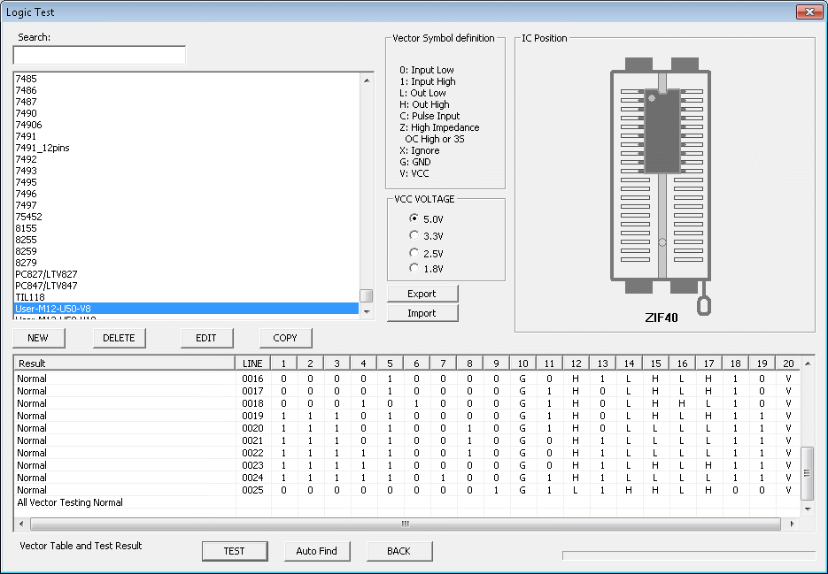

# TRS-80 M12/M16B U50 for Banked CPM3

In 1984/1985 Tandy issued [Technical Bulletin 12/16B:18](assets/TB_12-16B-18.pdf) which described an upgrade procedure and kit to support [Banked CPM](https://github.com/pski/model2archive/tree/master/Software/CPM/CPM%20Plus) on TRS-80 Model 12 (M12) and Model 16B (M16B).  The kit included a replacement for the U50  Memory Controller chip which was a [82S153 PLA](assets/TB_12-16B-18.pdf).  No machines with this upgrade have been found to date and it's unknown if Tandy actually sold any of these kits.  The purpose of this project is to recreate the replacement U50 using a 'modern' GAL device.

Tandy labeled their PLA's with a checksum or CRC that identified the device.  The original U50 is labeled A2AF.


The hope of course is to find an M12 or M16B with a U50 labeled other than A2AF which presumably would be the replacement U50.  Either finding or recreating the replacement U50 is a fairly old problem in the 8" Tandy community with posts in the Tandy discord as far back as 2018.  I learned of this problem only recently because I recently acquired a M2 and became active in the 8" Tandy community.  Although I have neither an affected machine nor an interest in running CPM recreating the replacement U50 seemed like an interesting problem that would benefit from a fresh set of eyes.

Aaron Brockbank had dumped two original U50 devices and recovered the [corresponding logic equations](source/U50-T12-Aaron.eqn) with jedutil (a tool from the MAME project).  Both dumps were the same so they were believed to be correct.  When I substituted the proper pin names and simplified the equations they looked very believable which further supported that the dumps were correct.

## Memory Organization

The Z80 memory of the M2/M12/M16/M6000 is organized into Banks and Pages.  A Bank is 64k which contains two 32k Pages.  The Banks are numbered 0-7 (8 banks in total for a maximum of 512k possible) and the Pages numbered 0-15.  Bank B (B=0-7) contains two Pages 2B+0 and 2B+1.  Thus a 64k memory card needs only the Bank to be configured withs three jumpers.

The Z80's 64k memory space is divided in half.  One half (32k or one page) is the paging area where the Page selected by the lower 4 bits of the `MEMCFG` register (`MEMCFG[3:0]`) is mapped.


The other half is called the common page where a fixed Page of memory is always mapped regardless of the value of `MEMCFG[3:0]`.

The difference between the Tandy and CPM memory organizations is that in the Tandy model the common page is the low half of memory, and in the CPM model the common page is the high half of memory.

The Tandy or CPM model is selected by lsb of the` OPSCFG` register (`OPSCFG[0]`) which is the `LOW_PAGE` signal.


When `LOW_PAGE=0` the Tandy mode is selected and when `LOW_PAGE=1` the CPM mode is selected.  LOW_PAGE is cleared to 0 by a hardware reset so Tandy mode is selected by default out of reset.

### Tandy Banking

In the Tandy banking mode the common page is mapped **low** and **Page 0** is the common page.  Pages 1-15 are the banking pages.  Since the common page must always be present, Bank 0 must always be present and Page 1 would be for banking.  If a second Bank is present it is typically configured as Bank 7 (Pages 14 and 15).

The common Page 0 is always active in the low half regardless of the value of `MEMCFG[3:0]`.  The behavior when `MEMCFG[3:0]=0` seems to be undefined.

### CPM Banking

In the CPM banking mode the common page is mapped **high** and **Page 1** is the common page.  Pages 0,2-15 are the banking pages.  Since the common page must always be present, Bank 0 must always be present and Page 0 would be for banking.

Since Banked CPM only makes sense with more than 64k of memory the Tech Bulletin requires a 128k upgrade and the additional Bank is configured as Bank 7 consistent with what is typical for Tandy mode.  Thus the banking Pages are 0,14,15.  The original M2 64k memory card does not implement the `OPSCFG` register (which is which is why the M2 is not supported) so Banked CPM on the M12/M16B is practically limited to 128k.  The Tandy Banked CPM3 is configured for 128k.

The common Page 1 is always active in the high half regardless of the value of `MEMCFG[3:0]`.  The behavior when `MEMCFG[3:0]=1` seems to be undefined.

## Original U50 Design

The [original logic equations](source/U50-T12-Aaron.eqn) obtained from jedutil are essentially the raw AND/OR array in human readable form and don't lend much insight into the operation of the device.  However, by substituting the signal names from the schematic and simplifying - and converting to WinCUPL for a pin compatible 16V8 GAL - the operation becomes much easier to understand.


```
Device   g16v8 ;

/* Inputs: */

PIN 1    = MA13;
PIN 2    = MA12;
PIN 3    = MA11;
PIN 4    = PAGE; /* port_FF[0] */
PIN 5    = LOW_PAGE; /* port_A8[0] */
PIN 6    = K16;
PIN 7    = REFRESH;
PIN 8   = VIDEO;
PIN 9   = ROM;
PIN 11   = !BANK0; /* port_FF[3:1]==0 */
PIN 13   = !BANKSEL; /* port_FF[3:1]==SEL where SEL is the jumper-selected bank 1-7 */
PIN 18   = MA15;
PIN 19   = MA14;

/* Outputs: */

PIN 12   = !ROMAD;
PIN 14   = ROMSEL;
PIN 15   = CASEN;
PIN 16   = RASEN1;
PIN 17   = RASEN0;

/* Equations: */

ROMAD = !MA15 & !MA14 & !MA13 & !MA12;

ROMSEL = !REFRESH & ROM & !MA15 & !MA14 & !MA13 & !MA12;

/* Memory Page 1 Selected */
PAGE1 = BANK0 &  PAGE;

/* Video Memory Selected */
VID = VIDEO & MA14 & MA13 & MA12 & MA11;

/* LOW_PAGE=0 */
R0_0 = !LOW_PAGE & ( (!MA15 &  'b'1) #
                     ( MA15 &  PAGE1 &   !VID) );
R1_0 = !LOW_PAGE &     MA15 &  BANKSEL & !VID & (!MA14 # !K16);

/* LOW_PAGE=1 */
R0_1 =  LOW_PAGE & ( (!MA15 &  PAGE1 &          ( MA14 # MA13 # MA12)) #
                     ( MA15 & (PAGE1 #   !VID)) );
R1_1 =  LOW_PAGE &    !MA15 &  BANKSEL & !K16;

RASEN0 = !REFRESH & (R0_0 # R0_1);
RASEN1 = !REFRESH & (R1_0 # R1_1);
CASEN =  !REFRESH & ((R0_0 # R1_0) # (R0_1 # R1_1));
```
Note although the 16V8 is pin compatible with the 82S153 their internal architectures are different so a design for the 82S153 won't necessarily fit a 16V8 - which is unfortunately the case here.  So the design above won't actually compile for a 16V8.  But for now that's not important.

The only output signals of interest here are the DRAM control signals `RASEN0`, `RASEN1`, and `CASEN` so the others can be ignored.  And it's readily seen that `CASEN = RASEN0 | RASEN1` so it's really just the *two* signals `RASEN0` and `RASEN1` that are of interest.  As already mentioned `LOW_PAGE` is the signal that selects between the Tandy and CPM modes.  It's also readily seen that `LOW_PAGE` essentially controls a mux that selects between two pairs of signals for `RASEN0` and `RASEN1` - `R0_0` and `R1_0` when `LOW_PAGE=0` (Tandy mode), and `R0_1` and `R1_1` when `LOW_PAGE=1` (CPM mode).

At this point it's apparent that the original U50 has *some* alternate banking implementation for `LOW_PAGE=1` mode.  What's not apparent though is whether the original design was intended for something other than CPM banking or if it was intended for CPM banking but has a bug.  But in any case our problem has now been reduced to just the two equations for `R0_1` and `R1_1`.

### Equations R0_0 and R0_1

`R0_0` and `R0_1` (selected by `LOW_PAGE`) control the 64k that contains the common page.  Since the common page and banked page are both 32k it should be apparent that address signal MA15 will select between the common page select and the banked page select.  This can be more clearly expressed in pseudocode by borrowing the ternary operator from c:
```
/* LOW_PAGE=0 */
R0_0 = !LOW_PAGE & ( !MA15 ? 'b'1 : (PAGE1 & !VID) );
```
It's easy to see that this makes sense.  When `MA15=0` the common page is selected so the RAM should be enabled regardless of everything else (hence the 'b'1).  When `MA15=1` the RAM should be enabled if Page 1 is selected.

One detail that has been ignored until now is video memory.  Video memory is mapped to F800h-FFFFh when enabled by `MEMCFG[7]` which is the `VIDEO` signal.  So the `!VID` term in the expression just enables or disables the RAM in the region of the video memory depending on the state of `VIDEO`.

Since CPM mode just swaps the common and banked pages in principle all that should be needed is to just invert `MA15` to obtain `R0_1`:
```
/* LOW_PAGE=1 */
R0_1 = LOW_PAGE & ( MA15 ? 'b'1 : (PAGE1 & !VID) );
```
which is also equivalent to swapping the operands of the ternary operator:
```
R0_1 = LOW_PAGE & ( !MA15 ? (PAGE1 & !VID) : 'b'1 );
```
But it isn't quite that simple for two reasons:
1) The video memory isn't swapped to low memory it remains at F800h-FFFFh in CPM mode --> the `!VID` term needs to stay where it was.
2) The banked page is Page 0 in CPM mode --> PAGE1 needs to be replaced with PAGE0.
So this becomes:
```
R0_1 = LOW_PAGE & ( !MA15 ? PAGE0 : !VID );
```
Comparing this to the original expression for R0_1:
```
R0_1 = LOW_PAGE & ( !MA15 ? (PAGE1 & (MA14 # MA13 # MA12)) : (PAGE1 # !VID) );
```
It's clearly not right and not even worth trying to rationalize.

### Equations R1_0 and R1_1

`R1_0` and `R1_1` (selected by `LOW_PAGE`) control the 64k that contains the two additional banked pages.
```
/* LOW_PAGE=0 */
R1_0 = !LOW_PAGE & MA15 & BANKSEL & !VID & (!MA14 # !K16);
```
Again it's easy to see that this makes sense.  The banked page is the high half (`MA15=1`), the configured bank must be selected (`BANKSEL`), and video memory must not be enabled (`!VID`).  Another detail that's been ignored until now is that there is an option for a 16k RAM instead of 64k - `K16=0` selects 64k and `K16=1` selects 16k.  Since 16k would make no sense for banked CPM 64k would always be selected (`K16=0`) the term `(!MA14 # !K16)` can just be ignored.

Again, since CPM mode just swaps the common and banked pages in principle all that should be needed is to just invert `MA15` to obtain `R1_1`:
```
/* LOW_PAGE=1 */
R1_1 = LOW_PAGE & !MA15 & BANKSEL & !VID & (!MA14 # !K16);
```
But again it isn't quite that simple for one reason:
1) The video memory isn't swapped to low memory it remains at F800h-FFFFh in CPM mode --> the `!VID` term just isn't needed.
```
/* LOW_PAGE=1 */
R1_1 = LOW_PAGE & !MA15 & BANKSEL & (!MA14 # !K16);
```
Comparing it to the original expression for R1_1:
```
R1_1 = LOW_PAGE & !MA15 & BANKSEL & !K16;
```
They differ only in the term that involves `K16`.  Since `K16=0` when 64k is installed the two expressions are effectively the same.  But I think the modified one seems more correct so we'll use the modified one.

## Modified U50 Design

The result of all of that is the one equation for `R0_1` needed to be changed.  The [updated design](source/M12-U50-V8/M12-U50-simplified-cpm.pld) is:
```
Device   g16v8 ;

/* Inputs: */

PIN 1    = MA13;
PIN 2    = MA12;
PIN 3    = MA11;
PIN 4    = PAGE; /* port_FF[0] */
PIN 5    = LOW_PAGE; /* port_A8[0] */
PIN 6    = K16;
PIN 7    = REFRESH;
PIN 8    = VIDEO;
PIN 9    = ROM;
PIN 11   = !BANK0; /* port_FF[3:1]==0 */
PIN 13   = !BANKSEL; /* port_FF[3:1]==SEL where SEL is the jumper-selected bank 1-7 */
PIN 18   = MA15;
PIN 19   = MA14;

/* Outputs: */

PIN 12   = !ROMAD;
PIN 14   = ROMSEL;
PIN 15   = CASEN;
PIN 16   = RASEN1;
PIN 17   = RASEN0;

/* Equations: */

ROMAD = !MA15 & !MA14 & !MA13 & !MA12;

ROMSEL = !REFRESH & ROM & !MA15 & !MA14 & !MA13 & !MA12;

/* Memory Page 1, 0 Selected */
PAGE1 = BANK0 &  PAGE;
PAGE0 = BANK0 & !PAGE;

/* Video Memory Selected */
VID = VIDEO & MA14 & MA13 & MA12 & MA11;

/* LOW_PAGE=0 */
R0_0 = !LOW_PAGE & ( (!MA15 &  'b'1) #
                     ( MA15 &  PAGE1 &   !VID) );
R1_0 = !LOW_PAGE &     MA15 &  BANKSEL & !VID & (!MA14 # !K16);

/* LOW_PAGE=1 */
R0_1 =  LOW_PAGE & ( (!MA15 &  PAGE0) #
                     ( MA15 &            !VID) );
R1_1 =  LOW_PAGE &    !MA15 &  BANKSEL & (!MA14 # !K16);

RASEN0 = !REFRESH & (R0_0 # R0_1);
RASEN1 = !REFRESH & (R1_0 # R1_1);
CASEN =  !REFRESH & ((R0_0 # R1_0) # (R0_1 # R1_1));
```
Even though the modified U50 design is simpler than the original it still does not fit in a 16V8.  However, since `K16=0` it can be just be set to 0 internal to the design.  With this one change it does fit and the end result is a pin compatible U50 replacement that works with Banked CPM!

However, there are still a few final caveats because WinCUPL is buggy:
* To force `K16=0` the K16 pin is renamed to K16x.
* Setting `K16='b'0;` in the design doesn't produce the correct result.  Instead an alternative expression for 0 is used `K16=K16x&!K16x;` - this evaluates to 0 and for unknown reason produces the correct result.
* `RASEN0`, `RASEN1`, and `CASEN` are inverted from what they should be.  To correct, the pin definitions were changed to `!RASEN0`, `!RASEN1`, and `!CASEN`.

## Programming and Testing

The ubiquitous TL866II (and similar) programmer can be used to program an ATF16V8 GAL using the [compiled result from WinCUPL](source/M12-U50-V8/M12-U50-SIMPLIFIED-CPM.jed).

The TL866II can also test IC's including custom parts with user defined test vectors.  A simple set of test vectors is included that can be used to test the programmed modified U50 before trying in a real M12/M16B.  The test vector set is way incomplete but is a good first order test especially if recompiling from source.  Import the [test vectors](source/M12-U50-V8/M12-U50-V8.lgc) into the TL866II, select the User-M12-U58-V8 part for testing.



If you test the original U50 82S153 with User-M12-U58-V8 for the modified design there will be a few errors corresponding to the changes of the modified design.

## Testing

A hacked version of the [Adrian Black diagnostic ROM](https://github.com/misterblack1/trs80-diagnosticrom) is provided for testing with the actual M12/M16B.  It was hacked to run as a loadable program (vs from ROM) and to test memory in CPM mode and to loop indefinitely instead of reboot.  It can be run from LSDOS or possibly other M2 DOS's.  The result with the modified U50 should be:


It should also run with the original U50 but in that case Page 0 will appear as missing:


The hacked diagnostic is [here](source/trs80m12diagcpm).

## The Pudding

As they say the proof is in the pudding.  All of that is moot if it doesn't actually work.  Banked CPM is available [here](https://github.com/pski/model2archive/tree/master/Software/CPM/CPM%20Plus) from Peter Cetinski's Model 2 archive.  And voila...


And [here](assets/CPMboot.mp4) is a video of it actually booting.

## Other Machines

This is also applicable to at least the Model 6000.  The M6000 has the same mainboard as the M12 but was probably omitted from the Tech Bulletin because the M6000 wasn't promoted as an 8-bit machine.  But if you wanted to try this with a M6000 it should work.

## Shout Out

Special thanks to the folks that supported me in this effort:

* Ken Brookner for introducing me this problem and providing details and testing.
* Aaron Brockbank for dumping the U50 and generating the equations.
* And especially Amardeep Chana for loaning me his Model 12 mainboard for experimentation and testing.
